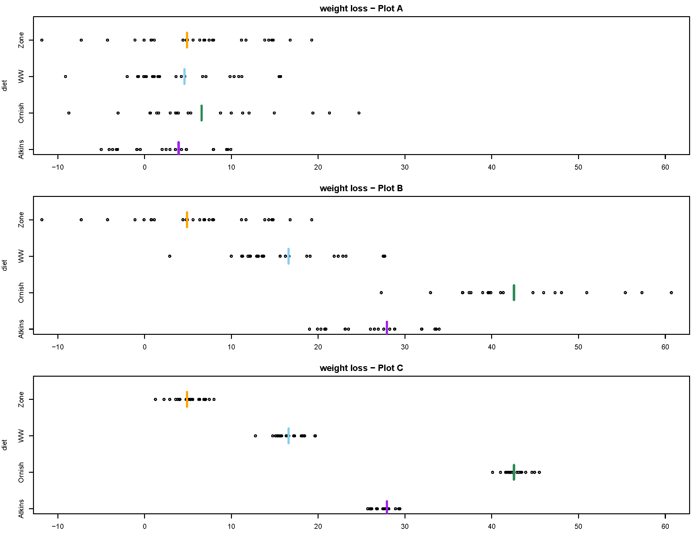

# Comparing multiple means: ANOVA $F$ procedures

When dealing with a numerical variable, we often summarize the variable with its mean. 
We have seen how to perform inference for a single mean and for comparing two means. 
Now we will see how to compare multiple means. The process is called "analysis of variance" or ANOVA, but that name is a little misleading. 
Our conclusions will still be about means.

::: {#exm-anova-idea}
Consider the following plots, which are all on the same
scale.
(This example just illustrates some general ideas so the context isn't important, but the data relate to a study on different types of diet plans
(Atkins, etc) and weight loss. Plot A displays the study data.
Plots B and C show hypothetical data sets with the same group sizes as
in Plot A.)
Group means are indicated by the colored vertical lines.

-   The SD for each group in Plot B equals the SD for the corresponding
group in Plot A.
-   The mean for each group in Plot C equals the mean for the corresponding
group in Plot B.
:::




1.  Rank the three scenarios (A, B, C) in order from weakest to strongest evidence to reject the
null hypothesis of no difference in means between groups. 
That is, rank the plots in order from largest to smallest p-value.

1.  Compare plots A and B.
    -   The variability *between* groups in Plot B is **(choose one: >, <, =)** the variability *between* groups in Plot A.
    -   The variability *within* groups in Plot B is **(choose one: >, <, =)** the variability *within* groups in Plot A.
1.  Compare plots B and C.
    -   The variability *between* groups in Plot C is **(choose one: >, <, =)** the variability *between* groups in Plot B.
    -   The variability *within* groups in Plot C is **(choose one: >, <, =)** the variability *within* groups in Plot B.
1.  Rank the plots in order from smallest to largest $F$ statistic.
\
\
\
\
\


-   @exm-anova-idea illustrates the idea behind the $F$ statistic: we reject the
null hypothesis of no difference in means between groups/populations/treatments if the observed variability *between* groups is large
relative to the observed variability *within* groups.
-   Roughly, we reject the null hypothesis if the ratio
$$
\frac{\text{variability between groups}}{\text{variability within groups}}
$$
is large enough. This idea is known as **analysis of variance (ANOVA)**.
-   The name ANOVA refers to *what* we are doing, and not *why* we are doing
it.
-   Remember, we are analyzing the variance to make a conclusion about the
*means*
-   The $F$ statistic quantifies the above ratio. The larger the value of the $F$ statistic the stronger the evidence to reject the null
hypothesis (of no difference) in favor of the alternative hypothesis (of
some difference). That is, the largest the $F$ statistic the smaller the p-value.


```{python}
#| echo: false
#| 
import pandas as pd
```


```{python}
#| echo: false
#| 
df_ks = pd.read_csv("https://raw.githubusercontent.com/kevindavisross/data301/refs/heads/main/data/knee_surgery.csv")


```


::: {#exm-anova-calc}
When medical therapy fails to relieve the pain of osteoarthritis of the knee, arthroscopic lavage or debridement is often recommended. More than 650,000 such procedures are performed each year at a cost of roughly \$5,000 each.
A recent double blind experiment investigated the effectiveness of these procedures[^1].  180 subjects with osteoarthritis of the knee  were randomly assigned to receive one of three treatments: arthroscopic lavage (which involved flushing the knee joint with fluid), arthroscopic debridement (which involved both lavage and shaving of cartilage and removal of debris), and placebo surgery (which involved incisions in the knee, but no insertion of instruments).  Various outcomes were measured; the summaries below summarize scores two years after the procedure on a knee-specific pain scale (0-100, with with higher scores indicating more severe pain).
Does any procedure tend to result in better pain scores on average?

The following summarizes the sample data.
Note that the sample size is the same within each group, which somewhat simplifies the computation of the ANOVA $F$ statistic.
:::


```{python}
#| echo: false

df_ks.groupby("treatment")["ksps2yr"].describe()
```

```{python}
#| echo: false

from plotnine import ggplot, aes, geom_histogram, facet_grid, theme, element_text, xlab

(ggplot(df_ks, aes(x="ksps2yr", fill="treatment"))
      + geom_histogram(bins=10)
      + facet_grid("treatment ~ .")
     + xlab("Knee specific pain score")  # custom x-axis label
     + theme(
         legend_position="none", 
         axis_text_x=element_text(rotation=45, hjust=1)
       )
)
```


1.  What statistic can be used to measure the variability *within* the
Debridement group? Lavage? Placebo? How could you combine these numbers
to to measure, in a single number, *variability within groups*?
\
\
\
\
\
1.  If the null hypothesis is true, what would you expect about the group
means?
\
\
\
\
\
1.  What statistic can be used to measure the observed variability *between*
groups?
\
\
\
\
\
1.  Regardless of whether or not the null hypothesis is true, which of the values from parts 1 nand 3 would you expect to be larger? Why?
\
\
\
\
\
1.	How could use measure the expected variability between groups if the null hypothesis is true?
\
\
\
\
\
1.  Compute the $F$ statistic as the value from part 3 divided by the value from part 5.
\
\
\
\
\
1.  What value would you expect $F$ to be if the
null hypothesis is true?
\
\
\
\
\
1.  Specify in detail how you could use simulation to approximate the null distribution of the $F$ statistic.
\
\
\
\
\
1.  @fig-anova-applet displays results from an applet used to run 10000
repetitions of the simulation.
How could you use the simulation results to approximate the p-value?
Could you use the empirical rule for Normal distributions?

    {#fig-anova-applet}

1.  The p-value is about 0.6. State a conclusion in context. Are the results "significant"?
\
\
\
\
\


**Hypothesis test for comparing multiple means: "One-way ANOVA $F$
test"**

-   Situation: $N$ observations of numerical response variable; categorical explanatory variable with $g$ groups
-   Parameters: $\mu_j$'s are the population/process/treatment response
means; $\sigma$ is the common group SD of responses
-   Goal: test for any differences in means
-   The null hypothesis is $H_0: \mu_1=\cdots=\mu_g$ ("no difference" or "no
treatment effect")
-   The alternative hypothesis is not $H_0$; that is, there is some
difference in means between groups,
$H_1: \mu_j\neq \mu_k \text{ for some } j\neq k$
-   Test statistic: one-way ANOVA $F$ statistic
$$
F = \frac{\sum_{j=1}^g n_j\left(\bar{x}_j - \bar{x}\right)^2/(g-1)}{\sum_{j=1}^g (n_j-1)s^2_j/(N-g)}
$$
-   The p-value is the probability of observing a value at least as large as
the observed $F$ based on an $F$ distribution with $g-1$ degrees of
freedom in the numerator and $N-g$ degrees of freedom in the
denominator
-   Assumptions:
    -   Either:
        -   The data are obtained through multiple unbiased and independent random samples from large populations
            -   Or from one unbiased random sample which can be classified into multiple
groups, and the groups can be considered independent of each other.
        -   The data are obtained from an experiment in which subjects were to two
treatments.
    -   No bias in data collection
    -   Comparing *means* is an appropriate analysis
    -   Equal variance: True SD of responses is same, $\sigma$, for each
population/process/treatment.
        -   Typically satisfied through random
assignment.
        -   Might not be satisfied if the data are sampled from
different populations/processes.
        -   One rule of thumb is that the largest
observed sample SD should be no more than twice the smallest.
-   Special case: when the group size $n$ is the same
for all $g$ groups is
\begin{align*}
F & = \frac{\text{group size} \times \text{variance of group means}}{\text{mean of group variances}}\\
& = \frac{n\sum_{j=1}^g \left(\bar{x}_j-\bar{x}\right)^2/(g-1)}{\sum_{j=1}^g s_j^2/g }
\end{align*}
-   The calculations are traditionally summarized in an **ANOVA table**

| Source                             | df    | SS (Sum of squares)                                                       | MS (Mean Square)                 | $F$                                            |
|------------------------------------|-------|---------------------------------------------------------------------------|----------------------------------|------------------------------------------------|
| Between groups (a.k.a. "treament") | $g-1$ | SS(between) = $\sum_{j=1}^g n_j\left(\bar{x}_j - \bar{x}\right)^2$        | $\frac{\text{SS(between)}}{g-1}$ | $\frac{\text{MS(between)}}{\text{MS(within)}}$ |
| Within groups (a.k.a. "error")     | $N-g$ | SS(within) = $\sum_{j=1}^g (n_j-1)s^2_j$                                  | $\frac{\text{SS(within)}}{N-g}$  |                                                |
| Total                              | $N-1$ | (SS(between) + SS(within)) = $\sum_{i=1}^N\left(x_{i} - \bar{x}\right)^2$ |                                  |                                                |


::: {#exm-anova-ci-motivation}
Continuing with the Ames housing data set.
Now suppose we want to compare sale price of homes by building type: single-family (1Fam), two-family (2fmCon), duplex, townhouse end unit (TwnhsE), townhouse inside unit (Twnhs). 
The following summarizes the sample data.
:::


```{python}
#| echo: false

df_ames = pd.read_csv("https://raw.githubusercontent.com/kevindavisross/data301/main/data/AmesHousing.txt", sep="\t")

df_ames["SingleFamily"] = (df_ames["Bldg Type"] == "1Fam")

df_ames["SalePriceK"] = df_ames["SalePrice"] / 1000

df_ames["BldgType"] = df_ames["Bldg Type"]

df_ames = df_ames[["BldgType", "SingleFamily", "SalePriceK", "Gr Liv Area"]]
```


```{python}
#| echo: false

df_ames.groupby("BldgType")["SalePriceK"].describe()
```

```{python}
#| echo: false
#| eval: false

from plotnine import geom_density

(
ggplot(df_ames, aes(x="SalePriceK", color="BldgType", fill="BldgType"))
    + geom_density(alpha=0.1)
    + xlab("Sale Price (K)")
)
```


```{python}
#| echo: false

from plotnine import (
    ggplot, aes, geom_histogram, facet_wrap, scale_fill_manual,
    labs, theme_minimal, theme, element_blank, after_stat
)

cp_colors = [
    "#154734",  # Cal Poly Green
    "#C69214",  # CP Mustard
    "#5B7F95",  # Morro Blue
    "#D9782D",  # Heritage Orange
    "#8A8D8F",  # Kennedy Gray
]

(
    ggplot(df_ames, aes(x="SalePriceK", fill="BldgType"))
    + geom_histogram(aes(y=after_stat("density")), bins=30)
    + facet_wrap("~BldgType", ncol=1)
    + scale_fill_manual(values=cp_colors)
    + labs(x="Sale Price ($K)", y="Density")
    + theme_minimal()
    + theme(
        legend_position="none"
    )
)
```


1.  @tbl-ames-anova is the ANOVA table. 
The $F$ statistic is 26.1 and the p-value is basically 0. 
State the conclusion of the ANOVA $F$ test in
context.
\
\
\
\
\
1.  What are some natural follow-up
questions? How might you use the data to answer them?
\
\
\
\
\


```{python}
#| echo: false
#| label: tbl-ames-anova
#| tbl-cap: ANOVA table for @exm-anova-ci.

import statsmodels.api as sm
from statsmodels.formula.api import ols

# Fit an OLS model
model = ols('SalePriceK ~ C(BldgType)', data=df_ames).fit()

# Perform ANOVA
anova_table = sm.stats.anova_lm(model, typ=2)
print(anova_table)

```


-   Rejecting the null hypothesis based on an $F$ statistic only tells you
that "the mean for at least one of the treatments (populations) is not
the same as the mean for at least one of the other treatments
(populations)".
-   The natural follow-up questions are: which treatment (population) means
differ? and by how much?
-   One approach when you have rejected the null hypothesis is to calculate
--- using software --- all pairwise confidence intervals. In particular,
which intervals do not contain zero?
-   When computing multiple confidence intervals, the multiple ($z^*$ or
$t^*$) should be increased[^3] to account for the **issue of multiple
comparisons** (recall @exr-multiple-ci and related notes).
-   **Tukey's method** is a widely used method for constructing simultaneous
confidence intervals for *all pairwise comparisons of means*. The
confidence intervals computed using Tukey's method already contain an
adjustment to account for multiple comparisons.


::: {#exm-anova-ci}
Continuing @exm-anova-ci-motivation. 
@tbl-tukey contains the results of Tukey pairwise 95% confidence intervals.
:::

1.  For which pairs of building types is there reasonable evidence of a difference in mean sale price?
For which pairs is there NOT reasonable evidence of a difference?
\
\
\
\
\

1.  Interpret in context each of the confidence intervals that does NOT contain 0.
\
\
\
\
\


```{python}
#| echo: false
#| label: tbl-tukey
#| tbl-cap: Tukey pairwise 95% confidence intervals for @exm-anova-ci.

from statsmodels.stats.multicomp import pairwise_tukeyhsd, MultiComparison

mc = MultiComparison(df_ames['SalePriceK'], df_ames['BldgType'])
tukey_result = mc.tukeyhsd(alpha=0.05)
print(tukey_result.summary())

```

```{python}
#| echo: false

tukey_result.plot_simultaneous()

```


[^1]: Source: <http://www.nejm.org/doi/full/10.1056/NEJMoa013259>


[^3]: There are several ways to do this. The simplest is a *Bonferroni*
    adjustment, which splits the error rate evenly across all intervals.
    For example, for simultaneous 95% confidence in 10 intervals (i.e. a
    total error rate of 0.05), use the $t^*$ factor for 99.5% confidence
    ($0.995 = 1-0.05/10$), $t^*= 2.8$, instead of 2 when computing the
    intervals. But the Tukey method is more widely used when comparing
    means.


## Exercises

::: {#exr-knee-ci}
Continuing @exm-anova-calc. 
If we were to compute a series of pairwise confidence intervals for the
difference in group means --- Debridement $-$ Lavage, Debridement $-$
Placebo, Lavage $-$ Placebo --- what value would each of the confidence
intervals contain? Why?
\
\
\
\
\
:::

::: {#exr-anova-concussion}
A study[^4] on brain trauma in football players included 3 groups, with 25 cases in each group. 
The control group consisted of healthy individuals with no history of brain trauma who were comparable to the other groups in age, sex, and education. 
The second group consisted of NCAA Division 1 college football players with no history of concussion, while the third group consisted of NCAA Division 1 college football players with a history of concussion. 
High resolution MRI was used to collect brain hippocampus volume (microliters). 

Plots and summary statistics of hippocampus volume (microliters) for all three groups
:::

```{python}
#| echo: false
#| 
df_brain = pd.read_csv("https://raw.githubusercontent.com/kevindavisross/gsb5518-notes/refs/heads/main/_data/FootballBrain.txt", sep = "\t")


```


```{python}
#| echo: false

df_brain.groupby("Group")["Hipp"].describe()
```


```{python}
#| echo: false


(
    ggplot(df_brain, aes(x="Hipp", fill="Group"))
    + geom_histogram(aes(y=after_stat("density")), bins=30)
    + facet_wrap("~Group", ncol=1)
    + labs(x="Hippocampus volume (microliters)", y="Density")
    + theme_minimal()
    + theme(
        legend_position="none"
    )
)
```


1.  Specify in words the null hypothesis.
1.  The SD of the numbers 7602.6, 6459.2, and 5734.6 is 941.8. 
Compute by hand the ANOVA $F$ statistic. 
1.  The ANOVA $F$ statistic is 31.5.
Describe in full detail how (in principle) you could use index cards to simulate the null distribution of the ANOVA $F$ statistic and how you would use the simulation results to find the p-value. (You don't have to compute the p-value; just explain how you could find it after you performed the simulation.)
1.  Use [this applet](https://www.rossmanchance.com/applets/2021/anovashuffle/AnovaShuffle.htm) to conduct the simulation from the previous part. 
    -   You will first need to copy and paste [the data](https://raw.githubusercontent.com/kevindavisross/gsb5518-notes/refs/heads/main/_data/FootballBrain.txt) from this study into the applet.
    -   In the Select Statistic box in the lower left, select F-statistic. Check that the Observed F-statistic is 31.473, and that your summary statistics match those from the summaries.
    -   Click the "Show Shuffle Options" box and then run the simulation. 
    -   Enter the appropriate value in the "Count Samples" box and click "Count" to compute the p-value.
1.  The p-value is basically 0 (see @tbl-anova-concussion). 
Write a clearly worded sentence containing the conclusion of the hypothesis test in the context of the problem.
1.  @tbl-tukey-concussion contains the Tukey confidence intervals. Which of the confidence intervals contain 0, and which do not?  Explain what this means.
1.  Write a clearly worded sentence interpreting each of the three confidence intervals in context.


```{python}
#| echo: false
#| label: tbl-anova-concussion
#| tbl-cap: ANOVA table for @exr-anova-concussion.

import statsmodels.api as sm
from statsmodels.formula.api import ols

# Fit an OLS model
model = ols('Hipp ~ C(Group)', data=df_brain).fit()

# Perform ANOVA
anova_table = sm.stats.anova_lm(model, typ=2)
print(anova_table)

```


```{python}
#| echo: false
#| label: tbl-tukey-concussion
#| tbl-cap: Tukey pairwise 95% confidence intervals for @exr-anova-concussion.

from statsmodels.stats.multicomp import pairwise_tukeyhsd, MultiComparison

mc = MultiComparison(df_brain['Hipp'], df_brain['Group'])
tukey_result = mc.tukeyhsd(alpha=0.05)
print(tukey_result.summary())

```


[^4]: Source: [Singh R, Meier T, Kuplicki R, Savitz J, et al., "Relationship of Collegiate Football Experience and Concussion With Hippocampal Volume and Cognitive Outcome," JAMA, 311(18), 2014.](https://jamanetwork.com/journals/jama/fullarticle/1869211#google_vignette)
