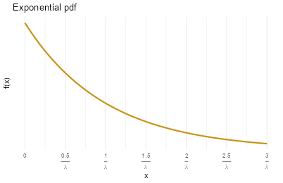
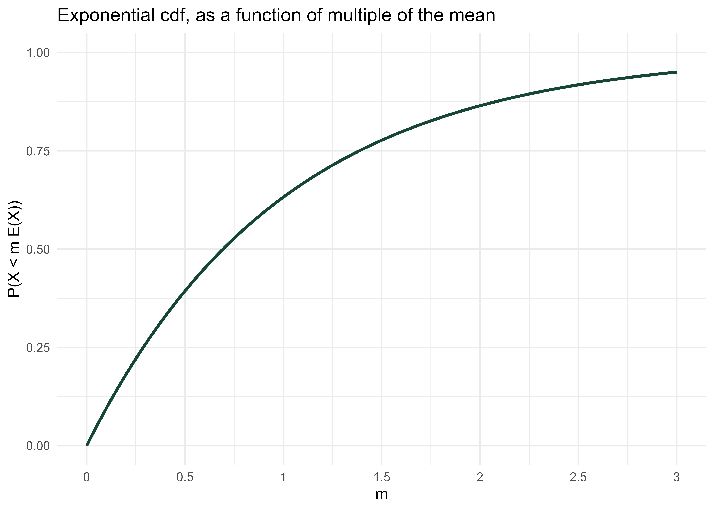

# Exponential Distributions



-   Exponential distributions are often used to model the waiting times between events in a random process that occur continuously over time.


::: {#exm-exponential-orders}
A business is tracking when online orders are placed on their website.
Suppose an order just occurred and let $X$ be the time until the next order is placed, measured in hours, including fractions of an hour.
Assume that $X$ has an *Exponential distribution with rate parameter 2.5 per hour*, with pdf 
$$
f_X(x) = 2.5 e^{-2.5x}, \qquad x >0
$$
:::

1.  Sketch the pdf of $X$. Roughly, what does this tell you about times between orders?\
    \
    \
    \
    \
1.	Compute and interpret $\text{P}(X < 0.5)$.\
    \
    \
    \
    \
1.	Determine the cdf of $X$.\
    \
    \
    \
    \
1.  Determine what percentile 2 hours is.\
    \
    \
    \
    \
1.	Compute and interpret the median of $X$.\
    \
    \
    \
    \
1.	Make an educated guess for $\text{E}(X)$. Then compute and interpret $\text{E}(X)$; did your guess work?\
    \
    \
    \
    \
1.	Compute and interpret $\text{P}(X < \text{E}(X))$.\
    \
    \
    \
    \


-   A continuous random variable $X$ has an **Exponential distribution** with *rate* parameter $\lambda>0$ if its pdf is
$$
f_X(x) =
\begin{cases}\lambda e^{-\lambda x}, & x > 0,\\
0, & \text{otherwise}
\end{cases}
$$
-   If $X$ has an Exponential($\lambda$) distribution then
\begin{align*}
\text{cdf:} \quad F_X(x) & = 1-e^{-\lambda x}, \quad x> 0\\
 \text{P}(X>x)  & = e^{-\lambda x}, \quad x> 0\\
 \text{quantile:} \quad Q(p) & = -(1/\lambda) \ln(1-p),\quad 0<p<1\\
\text{E}(X) & = \frac{1}{\lambda}\\
\text{Var}(X) & = \frac{1}{\lambda^2}\\
\text{SD}(X) & = \frac{1}{\lambda}
\end{align*}
-   Percentiles for any Exponential distribution follow a particular pattern in terms of "multiples of the mean":
    -   For any $m>0$,  $\text{P}(X \le m\text{E}(X)) = 1-e^{-m}$.
        -   For example, for any Exponential distribution the mean ($m=1$) is the 63.2rd percentile ($1-e^{-1}=0.632$).
    -   The $p$th percentile is $-\ln(1-p)$ times $\text{E}(X)$.
        -   For example, for any Exponential distribution the median ($p=0.5$) is 0.693 times the mean ($-\ln(1-0.5) = 0.693$).  
    -   See @tbl-exponential-rule.
-   Exponential distributions are often used to model the *waiting time* in a random process until some event occurs.
    -   $\lambda$ is the average *rate* at which events occur over time (e.g., 2 per hour)
    -   $1/\lambda$ is the mean time between events (e.g., 1/2 hour)
-   If $X$ has an Exponential($\lambda)$ distribution and $a>0$ is a constant, then $aX$  has an Exponential($\lambda/a$) distribution.
    -   If $X$ is measured in hours with rate $\lambda = 2$ per hour and mean 1/2 hour
    -   Then $60X$ is measured in minutes with rate $2/60$ per minute and mean $60(1/2)=30$ minutes.
-   If $X$ has an Exponential(1) distribution and $\lambda>0$ is a constant then $X/\lambda$ has an Exponential($\lambda$) distribution.
-   If $U$ has a Uniform(0, 1) distribution then $-\ln(1-U)$ has Exponential(1) distribution, and $-(1/\lambda) \ln(1-U)$ has an Exponential($\lambda$) distribution. 


::: {#fig-exponential layout-ncol=2}

{#fig-exponential-pdf}

{#fig-exponential-cdf}

A generic Exponential distribution with rate parameter $\lambda$ and mean $1/\lambda$. In the PDF plot, the x-axis is labeled in measurement units; in the CDF plot, the x-axis is labeled in terms of multiples of the mean.
:::

```{r}
#| label: tbl-exponential-rule
#| echo: false
#| warning: false
#| tbl-cap: "Percentiles for an Exponential distribution in terms of multiples of the mean"

library(tidyverse)
library(kableExtra)

z <- sort(c(seq(0.5, 5, 0.5), qexp(c(0.1, 0.25, 0.5, 0.75, 0.9), 1)))

p <- pexp(z, 1)


data.frame(
  p = paste(round(100 * p, 1), "%", sep = ""),
  z = paste(format(z, digits = 2), "times the mean")
) %>%
  kbl(col.names = c("Percentile", "Relative to mean"), align = c('r', 'l')) %>%
  kable_styling(fixed_thead = TRUE)
```


::: {#exm-poisson-to-exponential-cdf}
Continuing @exm-exponential-orders.
Let $N(1)$ be the number of orders in a 1 hour period, a discrete random variable. 
Then the expected value of $N(1)$ is 2.5 orders. 
If $N(2)$ is the number of orders that happen in a 2 hour period then
its expected value is $\text{E}(N(2)) =5$ orders. 
In general, if $N(t)$ is the number of orders in a $t$ hour period its expected value is $\text{E}(N(t)) =2.5t$ orders.

Assume that, for any $t$, the discrete random variable $N(t)$ has a Poisson distribution with parameter $2.5t$.
Now we'll consider what this assumption implies about the time between orders. Suppose an order just occurred and let $T$ be the time in hours until the next order; $T$ is a continuous random variable.


:::

1.  Interpret the event $\{T>0.5\}$.
How can you express this as an equivalent event involving a number of order?
\
\
\
\
\
1.  Compute and interpret $\text{P}(T > 0.5)$.
\
\
\
\
\
1.  Compute $\text{P}(T > t)$ as a function of $t>0$.
\
\
\
\
\
1.  Identify by name the distribution of $T$; be sure to specify the values of any relevant parameters.
\
\
\
\
\
1.  Compute and interpret $\text{E}(T)$.
\
\
\
\
\


-   Events occur continuously over time according to a  **Poisson process** with *rate* $\lambda>0$ (per unit time) if
    -   The number of events that occur in any time interval of length $t$ has a Poisson$(\lambda t)$ distribution.
        -   In particular, the distribution does not depend on the starting time or ending time of the interval, just its length.
    -   The numbers of events that occur in disjoint intervals of time are independent.
-   A random process is a Poisson process with rate $\lambda$ if and only if
    -   it is a counting process, that is, it is a process which counts the number of occurrences of some event over time.
    -   the *interarrival times* (times between events) $W_0, W_1,\ldots$ are independent Exponential$(\lambda)$ random variables


## Exercises


::: {#exr-exponential-spinner}
Use the "multiples of the mean rule" to create a circular spinner for simulating values from a generic Exponential distribution.
:::

1.   Version 1: label the circular axis in increments of 0.5, 1.0, 1.5, 2.0, 2.5, etc., multiple of the mean. Careful: the values should not be evenly spaced.\
    \
    \
    \
    \
1.  Sketch a histogram with equal bin widths---0 to 0.5, 0.5 to 1.0, 1.0 to 1.5, etc.---that you would expect to see after spinning the version 1 spinner many times.
Does it have an Exponential shape?\
    \
    \
    \
    \
1.   Version 2: label the circular axis so that your spinner has 10 sectors each with probability 0.1.\
    \
    \
    \
    \
1.  Sketch a histogram that you would expect to see after spinning the version 2 spinner many times. 
Start by sketching a histogram with *unequal* bin widths, then sketch the correspond equal bin width histogram.
Does it have an Exponential shape?\
    \
    \
    \
    \
1.   Explain how could you use this spinner (either version) to simulate values from an Exponential distribution with rate parameter 2.5 (like in @exm-exponential-orders).\
    \
    \
    \
    \


::: {#exr-exponential-orders-memoryless}
Continuing @exm-exponential-orders. 
Let $X$ be the waiting time (hours) until the next order and assume $X$ has an Exponential(2.5) distribution.
:::

1.  Find the conditional probability that the waiting time from now until the next order is greater than 3 hours given that no orders occur in the next hour. 
Be sure to write a valid probability statement involving $X$ before computing.
\
\
\
\
\
1.  Compare to $\text{P}(X > 2)$. 
What do you notice?
\
\
\
\
\

-   **Memoryless property.**  If $W$ has an Exponential($\lambda$) distribution then for any $w,h>0$
$$
\text{P}(W>w+h\,\vert\, W>w) = \text{P}(W>h)
$$
-   Given that we have already waited $w$ units of time, the conditional probability that we wait at least an additional $h$ units of time is the same as the unconditional probability that we wait at least  $h$ units of time.
-   In this sense, the future waiting time does not "remember" how long we have already waited.
-   A continuous random variable $W$ has the memoryless property if and only if $W$ has an Exponential distribution. 
That is, Exponential distributions are the *only* continuous^[Geometric distributions are the only discrete distributions with the discrete analog of the memoryless property.] distributions with the memoryless property.
-   If $W$ has an Exponential($\lambda$) distribution then the conditional distribution of the *excess* waiting time, $W - w$, given $\{W>w\}$ is Exponential($\lambda$).


