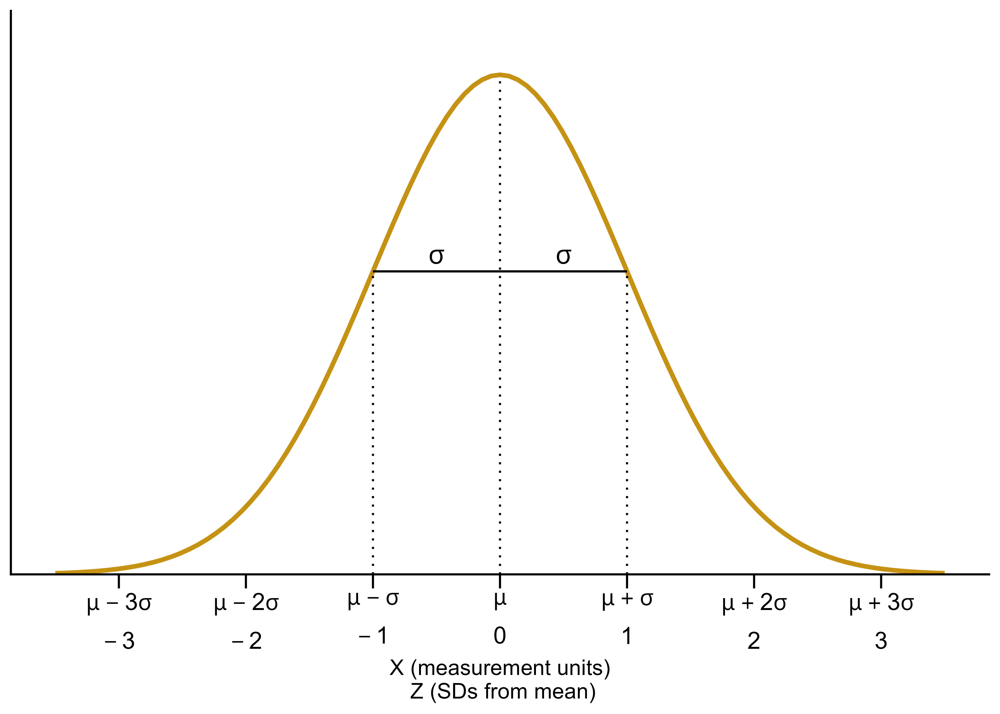

# Normal Distributions




-   Normal distributions are probably the most important distributions in probability and statistics.
-   A continuous random variable $X$ has a **Normal** (a.k.a., Gaussian) distribution with mean $\mu\in (-\infty,\infty)$ and standard deviation $\sigma>0$ if its pdf is $$
    f_X(x) = \frac{1}{\sigma\sqrt{2\pi}}\,\exp\left(-\frac{1}{2}\left(\frac{x-\mu}{\sigma}\right)^2\right), \quad -\infty<x<\infty
    $$
-   If $X$ has a Normal($\mu$, $\sigma$) distribution then
    \begin{align*}
    \text{E}(X) & = \mu\\
    \text{SD}(X) & = \sigma
    \end{align*}
-   A Normal density is a particular "bell-shaped" curve which is symmetric about its mean $\mu$. The mean $\mu$ is a *location* parameter: $\mu$ indicates where the center and peak of the distribution is.
-   The standard deviation $\sigma$ is a *scale* parameter: $\sigma$ indicates the distance from the mean to where the concavity of the density changes. That is, there are inflection points at $\mu\pm \sigma$.



-  The key to working with Normal distributions is to work in terms of standard deviations from the mean (that is, standardized values). 
    -   If $X$ has a Normal($\mu$, $\sigma$) distribution then $Z = \frac{X-\mu}{\sigma}$ has a Normal(0, 1) distribution
    -   If $Z$ has a Normal(0, 1) distribution then $X = \mu + \sigma Z$ has a Normal($\mu$, $\sigma$) distribution
-   Any Normal distribution follows an "empirical rule" which relates percentiles to standard deviation from the mean and defines the particular bell shape.
-   A continuous random variable $Z$ has a **Standard Normal** (a.k.a. Normal(0, 1)) distribution if its pdf is
$$
\phi(z) = \frac{1}{\sqrt{2\pi}}\,e^{-z^2/2}, \quad -\infty<z<\infty,\\
$$
-   The cdf is a Normal(0, 1) distribution is
$$
\Phi(z) = \int_{-\infty}^z\frac{1}{\sqrt{2\pi}}\,e^{-u^2/2}, \quad -\infty<z<\infty,\\
$$
but integrals of this type do not have a closed form and must be evaluated with software

```{r}
#| label: fig-normal-cdf-def
#| echo: false
#| fig-cap: "The Normal(0, 1) cdf. Provides the cdf for any Normal distribution if the variable is measured in *standard deviations from the mean*. It's the same cdf in both figures just with different values highlighted."
#| fig-subcap: 
#|   - "Percentiles highlighted in 0.5 increments of standard deviations from the mean"
#|   - "Deciles highligted in terms of standard deviations from the mean"
#| layout-ncol: 2

normal_m_increments <- data.frame(x = seq(-3, 3, 0.5)) |>
  mutate(p = pnorm(x))

ggplot(normal_m_increments, aes(x = x, y = p)) +
  stat_function(
    fun = function(x) pnorm(x),
    color = "skyblue",
    linewidth = 1.2
  ) +
  # vertical dashed lines
  geom_segment(
    data = normal_m_increments,
    aes(x = x, xend = x, y = -Inf, yend = p),
    linetype = "dashed",
    color = "gray40",
    inherit.aes = FALSE
  ) +
  # horizontal dashed lines
  geom_segment(
    data = normal_m_increments,
    aes(x = -Inf, xend = x, y = p, yend = p),
    linetype = "dashed",
    color = "gray40",
    inherit.aes = FALSE
  ) +
  scale_y_continuous(limits = c(0, 1), breaks = seq(0, 1, 0.1)) +
  scale_x_continuous(limits = c(-3.5, 3.5), breaks = seq(-3.5, 3.5, 0.5)) +
  theme_bw() + # removes gray background, keeps gridlines
  theme(
    panel.grid.major = element_blank(),
    panel.grid.minor = element_blank()
  ) +
  labs(x = "z (standard deviations from mean)", y = "cdf(z)")


normal_p_increments <- data.frame(p = seq(0.1, 0.9, 0.1)) |>
  mutate(x = qnorm(p))

ggplot(normal_p_increments, aes(x = x, y = p)) +
  stat_function(
    fun = function(x) pnorm(x),
    color = "skyblue",
    linewidth = 1.2
  ) +
  # vertical dashed lines
  geom_segment(
    data = normal_p_increments,
    aes(x = x, xend = x, y = -Inf, yend = p),
    linetype = "dashed",
    color = "gray40",
    inherit.aes = FALSE
  ) +
  # horizontal dashed lines
  geom_segment(
    data = normal_p_increments,
    aes(x = -Inf, xend = x, y = p, yend = p),
    linetype = "dashed",
    color = "gray40",
    inherit.aes = FALSE
  ) +
  scale_y_continuous(limits = c(0, 1), breaks = seq(0, 1, 0.1)) +
  scale_x_continuous(limits = c(-3.5, 3.5), breaks = seq(-3.5, 3.5, 0.5)) +
  theme_bw() + # removes gray background, keeps gridlines
  theme(
    panel.grid.major = element_blank(),
    panel.grid.minor = element_blank()
  ) +
  labs(x = "z (standard deviations from mean)", y = "cdf(z)")
```


```{r}
#| label: tbl-normal-cdf-def
#| echo: false
#| warning: false
#| tbl-cap: "Select percentiles for a Normal distribution in terms of standard deviations from the mean"
#| tbl-subcap: 
#|   - "In 0.5 increments of standard deviations from the mean"
#|   - "Deciles and quantiles as standard deviations from the mean"
#| layout-ncol: 2

z <- seq(-3.5, 3.5, 0.5)

p <- pnorm(z)

data.frame(
  p = paste(pmax(0.02, pmin(round(100 * p, 1), 99.98)), "%", sep = ""),
  z = paste(format(z, digits = 1), "")
) |>
  kbl(
    col.names = c("Percentile", "Standard deviations from the mean"),
    align = c('r', 'r')
  ) |>
  kable_styling(fixed_thead = TRUE)


p <- sort(c(0.01, 0.05, 0.95, 0.99, 0.25, 0.75, seq(0.1, 0.9, 0.1)))

z <- qnorm(p)

data.frame(
  p = paste(round(100 * p, 1), "%", sep = ""),
  z = paste(format(z, digits = 2), "")
) |>
  kbl(
    col.names = c("Percentile", "Standard deviations from the mean"),
    align = c('r', 'r')
  ) |>
  kable_styling(fixed_thead = TRUE)
```


```{r}
#| label: fig-normal-cdf-spinner
#| echo: false
#| warning: false
#| fig-cap: "A continuous *Normal(0, 1)* spinner. The same spinner is displayed in all figures, with different features highlighted. This spinner can be used to simulate values from any Normal distribution by simulating values in terms of standard deviations from the mean."
#| fig-subcap: 
#|   - "Each sector represents an interval with 5% probability"
#|   - "Each sector represents an interval with 1% probability"
#|   - "Values labeled in increments of 0.5 standard deviations from the mean"
#| layout-ncol: 3

mu <- 0
sigma <- 1
min_x <- -3.0
max_x <- 3.0

n <- 20

xp <- data.frame(
  x = (0:(n - 1)) / n,
  p = rep(1 / n, n)
)

cdf <- c(0, cumsum(xp$p))

plotp <- (cdf[-1] + cdf[-length(cdf)]) / 2

spinner1 <- ggplot(xp, aes(x = "", y = p, fill = x)) +
  geom_bar(width = 1, stat = "identity", color = "black", fill = "white") +
  coord_polar("y", start = 0) +
  theme_void() +
  # plot the possible values on the outside
  scale_y_continuous(
    breaks = xp$x,
    labels = c("...|...", round(mu + sigma * qnorm(xp$x[-1]), 2))
  ) +
  # theme(axis.text.x=element_text(size=12, face="bold"))
  theme(
    axis.text.x = element_text(
      size = 10,
      face = "bold",
      angle = c(0, 90 - 180 / 10 * (1:9), -90 - 180 / 10 * (10:19))
    )
  )

spinner1


n <- 100

xp <- data.frame(
  x = (0:(n - 1)) / n,
  p = rep(1 / n, n)
)

cdf <- c(0, cumsum(xp$p))

plotp <- (cdf[-1] + cdf[-length(cdf)]) / 2

spinner2 <- ggplot(xp, aes(x = "", y = p, fill = x)) +
  geom_bar(width = 1, stat = "identity", color = "black", fill = "white") +
  coord_polar("y", start = 0) +
  theme_void() +
  # plot the possible values on the outside
  scale_y_continuous(
    breaks = xp$x,
    minor_breaks = (0:99) / 100,
    labels = c("...|...", round(mu + sigma * qnorm(xp$x[-1]), 2))
  ) +
  theme(
    axis.text.x = element_text(
      size = 7,
      angle = c(0, 90 - 180 / 50 * (1:49), -90 - 180 / 50 * (50:99))
    )
  )

spinner2


x <- c("", "<-2", seq(-1.5, 1.5, 0.5), ">2")
p <- c(
  pnorm(-2),
  pnorm(seq(-1.5, 2.0, 0.5)) - pnorm(seq(-2.0, 1.5, 0.5)),
  1 - pnorm(2)
)

xp <- data.frame(x, p)

cdf <- c(0, cumsum(xp$p))


plotp <- (cdf[-1] + cdf[-length(cdf)]) / 2

spinner3 <- ggplot(xp, aes(x = "", y = p, fill = x)) +
  geom_bar(
    width = 1,
    stat = "identity",
    color = "black",
    fill = "white",
    linetype = 1
  ) +
  # coord_polar("y", start=0) +
  coord_curvedpolar("y", start = 0) +
  theme_void() +
  # plot the possible values on the outside
  scale_y_continuous(
    breaks = cdf[-c(1, length(cdf))],
    labels = seq(-2, 2, 0.5)
  ) +
  # theme(axis.text.x=element_text(angle=c(90-180/50*(0:49), -90-180/50*(50:99)), size=8)) +
  theme(axis.text.x = element_text(angle = 0, size = 12)) +
  # annotate(geom="segment", y=(0:19)/20+0.000, yend = (0:19)/20+0.000,
  #          x=1.48, xend= 1.52) +
  # plot the probabilities as percents inside
  geom_text(
    aes(y = plotp, label = percent(p, accuracy = 0.1)),
    size = 4,
    color = c(NA, rep("black", 8), rep(NA, 1))
  )

spinner3
```


-   @fig-normal-cdf-def defines a Normal distribution by specifying all of its percentiles. 
-   The empirical rule is often described in terms of "within [blank] standard deviations of the mean" as in the following:
    -   38% of values are within 0.5 standard deviations of the mean
    -   50% of values are withing 0.67 standard deviations of the mean
    -   68% of values are within 1 standard deviation of the mean
    -   87% of values are within 1.5 standard deviations of the mean
    -   95% of values are within 2 standard deviations of the mean
    -   99% of values are within 2.6 standard deviations of the mean
    -   99.7% of values are within 3 standard deviations of the mean
    -   99.99% of values are within 4 standard deviations of the mean


{width=100%}


::: {#exm-normal-weight}
The wrapper of a package of candy lists a weight of 47.9 grams.
Naturally, the weights of individual packages vary somewhat.
Suppose package weights have an approximate Normal distribution with a mean of 49.8 grams and a standard deviation of 1.3 grams.
:::


1.  Sketch the distribution of package weights. Carefully label the variable axis. It is helpful to draw two axes: one in the measurement units of the variable, and one in standardized units.\
    \
    \
    \
    \
2.  Why wouldn't the company print the mean weight of 49.8 grams as the weight on the package?\
    \
    \
    \
    \
3.  Estimate $\text{P}(X < 47.9)$ and interpret the value in context.\
    \
    \
    \
    \
4.  Estimate $\text{P}(47.9<X < 53.0)$ and interpret the value in context.
    \
    \
    \
    \
5.  Suppose that the company only wants 1% of packages to be underweight. Find the weight that must be printed on the packages.\
    \
    \
    \
    \
6.  Find the 99th percentile of package weights.\
    \
    \
    \
    \


## Exercises


::: {#exr-normal-errors}
A bank uses an applicant's score on some criteria to decide whether or not to approve their loan application.
Based on past history, the bank has determined that 
:::

-   Scores for those who repay the loan follow a Normal distribution with mean 60 and SD 8
-   Scores for those who do NOT repay the loan follow a Normal distribution with mean 40 and SD 12
 
When someone applies for a loan the bank does not know whether the applicant will eventually repay the loan.
How can the bank use the applicant's score to decide whether or not to approve the loan?

1.  Draw sketches of these two normal curves on the same axis.\ 
    \
    \
    \
    \
1.  Suggest a general form for the decision rule, based on an applicant's score, for deciding whether or not to approve the applicant's loan. ("Approve the loan if the score...") Just give the general idea; you're not computing anything yet.\
    \
    \
    \
    \
1.  Describe in words the two kinds of errors the bank could make in this situation.\
    \
    \
    \
    \
1.  Determine the probability that the bank incorrectly rejects the application of someone who would repay.
Shade in the corresponding region under the Normal curve, and interpret this probability.\
    \
    \
    \
    \
1.  Determine the probability that the bank incorrectly approves the application of someone who would NOT repay.
Shade in the corresponding region under the Normal curve, and interpret this probability.\
    \
    \
    \
    \
1.  In which direction---smaller or larger---would you need to change the decision rule's cutoff value in order to decrease the probability that an applicant who would repay the loan is incorrectly rejected? Would the probability of the other kind of error---incorrectly approving a loan for an applicant who would not repay it---increase or decrease with this new cutoff value?\
    \
    \
    \
    \
1.  Determine the cutoff value needed to decrease the probability that an applicant who would repay the loan is incorrectly rejected to 0.05.\
    \
    \
    \
    \
1.  Determine the other error probability with this new cut-off rule.\ 
    \
    \
    \
    \
1.  Now repeat the two previous parts with the goal of decreasing to 0.05 the probability of incorrectly approving an applicant who would not repay the loan.\
    \
    \
    \
    \
1.  If you consider the two kinds of errors to be equally serious, how might you decide which of the three decision rules considered so far is the best?\
    \
    \
    \
    \
1.  Which error do you think the bank would consider more serious?
In which direction would that move the threshold?\
    \
    \
    \
    \


-   Making decisions/predictions based on data often involves trade-offs.
-   Decreasing the probability of one kind of error often comes at the expense of increasing the probability of another kind of error.


