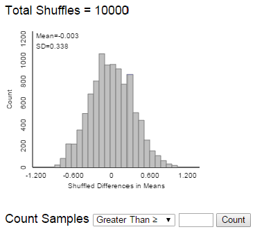
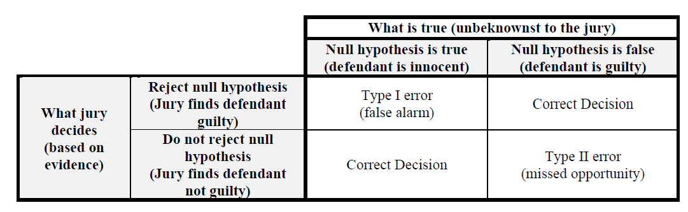

# Null Hypothesis Testing

-   Statisticians view conjectures about a population as competing
    *hypotheses*.
    These hypotheses
    usually constitute claims about the values of certain parameters.
-   A statistical **(null) hypothesis test** consists of using data to
    make a decision regarding two explanations (hypotheses).
-   The **null hypothesis**, denoted $H_0$, represents the "status
    quo/no difference/no effect/no association" hypothesis.
    -   If the null hypothesis is true then any observed
        difference/effect/association is just due to "random chance"
        resulting from natural sampling variability
-   The **alternative hypothesis**, denoted $H_a$ (or $H_1$), typically
    corresponds to what the researchers are hoping to gather evidence to
    support, and thus is a statement in line with the research
    conjecture
-   A statistical hypothesis test assesses if the data provide evidence
    to rule out the "random chance" explanation (which corresponds to
    the null hypothesis) in favor of the explanation provided by the
    research conjecture (alternative hypothesis).
-   The null hypothesis is often of the form
    $$H_0: \text{parameter} = \text{hypothesized value}$$ where the
    hypothesized value is a specific number determined by the research
    question (often 0 for "no difference").
-   The alternative hypotheses is often of one of the following forms
    $$\begin{aligned}
        \text{Case 1a:}\quad  H_a: \text{parameter} &> \text{hypothesized value}\\
        \text{Case 1b:}\quad H_a: \text{parameter} &< \text{hypothesized value}\\
        \text{Case 2:}\quad H_a: \text{parameter} &\neq \text{hypothesized value (``two-sided'')}
    \end{aligned}$$ Which of the three cases above is appropriate is
    determined by the research conjecture. When in doubt, use a
    two-sided ($\neq$) alternative.


::: {#exm-nht-permutation}
Did the New England Patriots deliberately deflate
footballs in an NFL playoff game against the Indianapolis Colts on
January 18, 2015? The following table[^1] summarizes the decrease in air
pressure (psi), from pre-game to halftime, for the footballs from each
team that were checked at halftime by officials.
:::

| Team     | Deflation (psi) |      |      |      |      |      |      |      |      |      |      | Size |  Mean |    SD |
|----------|----------------:|-----:|-----:|-----:|-----:|-----:|-----:|-----:|-----:|-----:|-----:|-----:|------:|------:|
| Patriots |            1.00 | 1.65 | 1.35 | 1.80 | 1.40 | 0.90 | 0.65 | 1.40 | 1.55 | 2.00 | 1.60 |   11 | 1.391 | 0.402 |
| Colts    |            0.30 | 0.25 | 0.50 | 0.45 |      |      |      |      |      |      |      |    4 | 0.375 | 0.119 |                                                 4   0.375   0.119

1.  State the null and the alternative hypotheses in words.
    \
    \
    \
    \
    \
1.  Compute the observed difference in sample means.
    \
    \
    \
    \
    \
1.  If there were no difference between the Patriots and the Colts footballs, what would you expect the difference in sample means to be?
    Is the fact that we observed another value necessarily evidence that the Patriots footballs tended to deflate more than the Colts?
    \
    \
    \
    \
    \
1.  Suppose we want to assess if it is plausible that the Patriots
    didn't interfere with the footballs, and the observed difference in
    sample means is just due to chance variability.
    Specify how the "null distribution" of the statistic could be
    simulated with cards.
    Note: this is NOT bootstrapping; how is it different?
    \
    \
    \
    \
    \
1.  Use cards to perform one repetition of the above simulation, record
    the results here, and compute the appropriate difference in means.
        
    | Team     | Deflation (psi) |   |   |   |   |   |   |   |   |   |   | Size | Mean | SD |
    |----------|----------------:|:-:|:-:|:-:|:-:|:-:|:-:|:-:|:-:|:-:|:-:|-----:|-----:|---:|
    | Patriots |                 |   |   |   |   |   |   |   |   |   |   |   11 |      |    |
    | Colts    |                 |   |   |   | X | X | X | X | X | X | X |    4 |      |    |

    : {.table-bordered}

1.	How could we use the results of many repetitions to assess if the data provides evidence that the Patriots footballs really tended to deflate more than the Colts?
    \
    \
    \
    \
    \
1.  The following plot displays results from an [applet](https://www.rossmanchance.com/applets/2021/anovashuffle/AnovaShuffle.htm?hideExtras=2) used to run 10000
    repetitions of the simulation (the plot on the left displays the results
    from just the first 100 repetitions). Estimate the probability of
    observing a difference in sample means as extreme as the observed difference just by chance 
    if there were no real difference between the Patriots and Colts footballs.

    ::: {#fig-permutation-applet layout-ncol=2}
    {#fig-permutation-applet-1}

    {#fig-permutation-applet-2}

    Permutation simulation of null distribution in @exm-nht-permutation.
    :::

1.	The simulation outputs the p-value, which is close to 0. 
Interpret this p-value.
    \
    \
    \
    \
    \
1.	One explanation is "there is no real difference and the observed difference of 1.016 is just random chance". Is that a plausible explanation? If not, what is a more plausible explanation?
    \
    \
    \
    \
    \

-   To assess the plausibility of the "random chance" explanation for the
    observed result --- corresponding to the null hypothesis being true --- we
    need to know the pattern of sampling variability of the
    statistic that would be expected just due to random chance if the
    null hypothesis were true. This is called the **null distribution**
    of the statistic.
-   If the actual observed value of the statistic is not consistent with
    this pattern, then we have convincing evidence that the results did
    not occur by random chance alone, and we have evidence to reject the
    null hypothesis
-   The (simulated) null distribution provides a picture of what typical
    values of the statistic would be expected just by random chance
    alone if the null hypothesis were true.
-   The question is then: how surprising is the result we actually
    observed from the perspective of the null distribution? If the
    result would be very surprising, then "random chance" is not a
    plausible explanation for the observed result.
-   This gives us evidence to rule out a "random chance" explanation
    like in favor of a "research conjecture" explanation.
-   In other words, the more surprising the observed result would be
    just due to random chance, the stronger the evidence to **reject the
    null hypothesis** in favor of the alternative hypothesis.
-   We quantify "how surprising" with a p-value.
    -   The **p-value** is the probability of observing a value at least
        as extreme as the value actually observed, when the null
        hypothesis is true.
    -   The p-value can be estimated by the proportion (out of the total
        number of repetitions) of values in the simulated null
        distribution that are *at least as extreme* as the actual
        observed value of the statistic.
        -   Which tail(s) constitutes "at least as extreme\" is
            determined by the form of the *alternative hypothesis*
-   The smaller the p-value --- that is, the closer the p-value is to 0
    --- the less plausible it is that the observed result occurred just
    by random chance alone.
-   Thus, **the smaller the p-value the stronger the evidence to reject
    the null hypothesis in favor of the alternative hypothesis.**
-   If the observed results provide strong evidence that the data did
    not arise by random chance alone --- that is, when the p-value is
    small --- then there is evidence of a **statistically discernible difference**.
-   How small is a small p-value? You should think of a sliding scale: the
    closer the p-value gets to 0 the stronger the evidence to reject the
    null hypothesis in favor of the alternative. Some guidelines are below, but these
    should *not* be followed too strictly (especially when performing
    many hypothesis tests simultaneously):
-   Do NOT rely strictly on arbitrary thresholds like p-value $<$ 0.05.

| p-value                  | Evidence to reject the null hypothesis?    |
|--------------------------|-----------------------------------------|
| Above 0.10               | Little to no evidence                      |
| Between 0.01 and 0.10    | Weak-ish evidence                           |
| Between 0.001 and 0.01   | Moderate-ish evidence                       |
| Between 0.0001 and 0.001 | Strong-ish evidence                         |
| Less than 0.0001         | Very strong-ish evidence                    |


::: {#exm-two-sample-t}
In a study published in 2016, participants were asked "How much does an average new small car cost?"
But participants were randomly assigned to one of two versions of this question:

-   Does an average new car cost less or more than **100 hundred thousand** dollars? 
How much does an average new small car cost?
-   Does an average new car cost less or more than **1 thousand** dollars? 
How much does an average new small car cost?

Did people tend to responded with different amounts for the new car price based on the wording of the question?

The following summarizes the sample data.
:::


```{python}
#| echo: false

import pandas as pd

df = pd.read_csv("https://raw.githubusercontent.com/kevindavisross/gsb5518-notes/refs/heads/main/_data/anchoring.csv")

```

```{python}
#| echo: false
df.groupby('anchor')['estimate'].describe()
```


```{python}
#| echo: false

from plotnine import (
    ggplot, aes, geom_histogram, facet_wrap, scale_fill_manual,
    labs, theme_minimal, theme, element_blank, after_stat
)


(
    ggplot(df, aes(x="estimate", fill="anchor"))
    + geom_histogram(aes(y=after_stat("density")), bins=30)
    + facet_wrap("~anchor", ncol=1)
    + labs(x="Estimated new car price (dollars)", y="Density")
    + theme_minimal()
    + theme(
        legend_position="none"
    )
)
```


1.	Identify the null hypothesis.
\
\
\
\
\
1.	Describe in detail how to use simulation to compute the p-value.
\
\
\
\
\
1.	Describe in detail how to use theory to compute the p-value.
\
\
\
\
\
1.	The p-value is <0.0001. State a conclusion in context.
\
\
\
\
\
1.  Does the p-value by itself provide evidence that the people who saw the 100 thousand dollar "anchor" tended to give *much* higher estimates than those who saw the 1 thousand dollar "anchor"? 
Explain.
\
\
\
\
\
1.  How could we address the question in the previous part? 
Perform a relevant analysis and interpret the results in context.
\
\
\
\
\


**Two-sample $t$ test for a difference in population (or treatment) means.**

-   Situation: binary explanatory variable (population/treatment 1, 2)
    and numerical response variable
-   Parameter: $\mu_1-\mu_2$ is the difference in population means
    (treatment means)
-   Goal: assess the strength of the evidence against the "no
    difference" or "no treatment effect" hypothesis
-   The null hypothesis is $H_0: \mu_1-\mu_2=0$
-   The alternative hypothesis is one of $H_a: \mu_1-\mu_2>0$,
    $H_a: \mu_1-\mu_2<0$, or $H_a: \mu_1-\mu_2\neq0$
    -   When in doubt, use a two-sided alternative and a two-tailed
    p-value.
-   Statistic: $\bar{x}_1-\bar{x}_2$ is the difference in sample means
    for samples (groups) of size $n_1, n_2$
-   The SE of the difference in sample means is
    $$
    \textrm{SE}(\bar{x}_1-\bar{x}_2) = \sqrt{\frac{s_1^2}{n_1}+\frac{s_2^2}{n_2}} = \sqrt{\textrm{SE}^2(\bar{x}_1)+\textrm{SE}^2(\bar{x}_2)}
    $$
-   Test statistic:
    $$
    t = \frac{\text{observed}-\text{hypothesized}}{\text{SE}} = \frac{\bar{x}_1-\bar{x}_2-0}{\sqrt{\frac{s_1^2}{n_1}+\frac{s_2^2}{n_2}}}
    $$
-   The p-value is the probability of observing a value at least as
    extreme as $t$, in the tail direction indicated by the alternative
    hypothesis, for the $t$-distribution with (complicated) degrees of freedom.
    -   In almost all situations encountered in practice you can use the usual empirical rule for Normal distributions
-   Assumptions:
    -   Either
        -   The data are obtained through two unbiased and independent
            random samples from large populations
            -   Or from one unbiased random sample which is classified
                according to two variables, and the two groups can be
                considered independent of each other.
        -   The data are obtained from an experiment in which subjects
            were randomly assigned to two treatments.
    -   No bias in data collection
    -   Difference in population means is the parameter you want to
        estimate
-   The $t$ procedures for population means are valid as long as the
    sample size is large enough, regardless of the shape of the
    population distribution.
-   **However, if the population distributions are highly skewed, then
    the population *medians* might be more appropriate parameters to
    consider as measures of center.**
-   Which is more appropriate, the population means or the population
    medians, depends on the purpose for the inference.
-   Also remember that sample means and SDs, and hence $t$ procedures,
    are sensitive to outliers and extreme values.


::: {#exm-two-sample-median}
Continuing @exm-two-sample-t. 
In this data set there are some outliers that influence the sample means. 
What if instead we wanted to compare sample medians? 
There is no theory-based test for comparing medians like the two-sample $t$ test for comparing means. 
:::

1.  Explain in full detail how you could perform a simulation to approximate the p-value based on the difference in sample medians.
\
\
\
\
\
1.  Conduct the simulation and use it to compute the p-value. 
Then interpret the result in context.
\
\
\
\
\

## Exercises


::: {#exr-two-sample-t-ames}
Continuing with the Ames housing data set.
Now suppose we want to compare sale prices of single family homes with other homes (including condos, townhouses, etc).
In particular, do single family homes tend to have higher sale prices on average than other homes?

The following summarizes the sample data.
:::


```{python}
#| echo: false

import numpy as np

df_ames = pd.read_csv("https://raw.githubusercontent.com/kevindavisross/data301/main/data/AmesHousing.txt", sep="\t")

df_ames["SingleFamily"] = np.where(df_ames["Bldg Type"] == "1Fam", "SingleFamily", "Other")

df_ames["SalePriceK"] = df_ames["SalePrice"] / 1000

df_ames["BldgType"] = df_ames["Bldg Type"]

df_ames = df_ames[["BldgType", "SingleFamily", "SalePriceK", "Gr Liv Area"]]
```

```{python}
#| echo: false

df_ames.groupby("SingleFamily")["SalePriceK"].describe()
```


```{python}
#| echo: false

from plotnine import (
    ggplot, aes, geom_histogram, facet_wrap, scale_fill_manual,
    labs, theme_minimal, theme, element_blank, after_stat
)


(
    ggplot(df_ames, aes(x="SalePriceK", fill="SingleFamily"))
    + geom_histogram(aes(y=after_stat("density")), bins=30)
    + facet_wrap("~SingleFamily", ncol=1)
    + labs(x="Sale Price (thousand dollars)", y="Density")
    + theme_minimal()
    + theme(
        legend_position="none"
    )
)
```


1.  Explain in detail how you could use simulation to approximate the p-value.
\
\
\
\
\
1.  Use the sample data to conduct by hand an appropriate hypothesis test.
\
\
\
\
\
1.  Write a clearly worded sentence interpreting the p-value in context.
\
\
\
\
\
1.  Does the p-value by itself provide evidence that single family homes tend to have higher sale prices on average than other homes?
Explain.
\
\
\
\
\
1.  Does the p-value by itself provide evidence that single family homes tend to have *much* higher sale prices on average than other homes?
Explain.
\
\
\
\
\
1.  How could we address the question in the previous part?
Perform a relevant analysis and interpret the results in context.
\
\
\
\
\


-   Confidence intervals and hypothesis tests are commonly used in
    conjunction, but they address different questions
    -   Hypothesis test: How strong is the evidence that there is a difference (or association or effect)?
    -   Confidence interval: How large is the difference (or association or effect)?
-   A confidence interval
    -   provides a range of plausible values
    -   but the cut-off between plausible and implausible is arbitrary
        (e.g. 95% confidence corresponds to $\alpha=0.05$)
        -   But be especially careful about interpreting confidence when
            conducting multiple confidence intervals.
-   A null hypothesis test
    -   Considers the plausibility of only a single hypothesized value
    -   But provides a precise measure---the p-value---of the
        plausibility of the particular hypothesized value in light of
        the observed data
        -   But be especially careful about interpreting p-values when
            conducting multiple hypothesis tests.


::: {#exr-ht-coin}
A 2007 paper[^coin] suggests that in coin-tossing there is
a particular "dynamical bias" that causes a coin to be slightly more
likely to land the same way up as it started. That is, the paper claims
that a coin is more likely to land facing Heads up if it starts facing
Heads up than if it starts facing Tails up; likewise if it starts facing
Tails up. Is this really true? Two students at Berkeley investigated
this phenomenon by tossing a coin many, many times.
:::


1.  Suppose that out of 10000 flips, 5083 landed the same way they started, for a sample proportion of 0.5083. Based on this data, can you conclude that a coin is more
    likely to land the same way it started using a strict "significance
    level" of $\alpha=0.05$?
    The p-value is 0.0495. 
    State your conclusion at strict level $\alpha=0.05$ in
    context. Note: One goal of the example is to show you one reason why using a strict $\alpha$ is a bad idea.
\
\
\
\
\
3.  Repeat the previous part assuming 5082 out of 10000 flips landed the same way
    they started; the sample proportion is 0.5082 and the p-value is now 0.0515.
\
\
\
\
\
4.  Compare the two previous parts. Give one reason
    why you should be wary of using a "significance level" (like 0.05)
    too strictly.
\
\
\
\
\
5.  The students actually tossed the coin 40,000 times![^coin2]. Of the
    40,000 flips, 20,245 landed the same way they started, for a sample proportion of 0.5062. The p-value is 0.0072 and state a conclusion in context. (Do NOT
    use a strict $\alpha$ level.)
    Which result---20245 out of 40000 or 5083 out of 10000---gives stronger evidence to reject the null hypothesis?
\
\
\
\
\
6.  Would you say the results of the real study, in the previous part, are newsworthy?
    Or important? Or "significant"? Using this problem as an example,
    explain why "statistically significant" is a poor choice of words.
    In other words, explain why "statistical significance" is not the
    same as practical importance.
\
\
\
\
\

-   Remember: the smaller the p-value, the stronger the evidence to
    reject the null hypothesis.
    -   But how small is small enough?
-   A "significance level", usually denoted $\alpha$, is a pre-specified
    cut-off for how small the p-value must be in order to reject the
    null hypothesis. The most common value is $\alpha=0.05$.
    -   HOWEVER, in general, do NOT rely too strictly on a significance
    level $\alpha$.
    -   In fact, for years the the [American Statistical Association](https://www.tandfonline.com/doi/full/10.1080/00031305.2019.1583913#d1e335) has said to stop using values like 0.05 to make binary reject/not reject decisions.
-   If the p-value is small the result is sometimes
        referred to as "statistically significant".
    -   HOWEVER, this is a poor choice of words.
    -   In fact, for years the [American Statistical Association](https://www.amstat.org/news-listing/2021/10/08/editorial-calls-time-on-statistically-significant-in-research) has said to stop using the term "statistically significant". Quote: "'statistically significant'---don't say it and don't use it."
-   Reporting the actual p-value and interpreting it as a sliding scale of weak/moderate/strong evidence to reject the null hypothesis is is
    much more informative than just reporting "reject $H_0$ at level
    $\alpha=0.05$" or "p-value $<0.05$".
-   Remember that hypothesis testing and p-values are just small parts of a much bigger picture. A hypothesis test provides some information, but there are many important questions that hypothesis testing and p-values do not have the ability to address.
-   Beware the meaning of "significant".
-   A "statistically significant" result is not necessarily
    practically important or meaningful. Rather, it is just is more extreme than what would
    be expected to occur just due to chance if the null hypothesis were true, but not necessarily
    large in practical terms.
-   Especially when the sample size is large, even a small observed
    difference can result in a small p-value.
-   On the other hand, an observed result might have practical
    significance even when the p-value is not small.
-   A confidence interval estimates the size of the difference,
    which helps in judging practical significance. It is also
    important to consider *effect size*.
-   In short: Do NOT use $\alpha = 0.05$ and do NOT use the terminology "statistically significant" do NOT pay too much attention to hypothesis tests.


::: {#exr-ht-esp}
(For this exercise, you'll need to believe it's possible for a person to have ESP.)
"Ganzfeld studies" test psychic ability (like ESP).
Ganzfeld studies involve two people, a "sender" and a "receiver", who
are placed in separate acoustically-shielded rooms. The sender looks at
a "target" image on a television screen (which may be a static
photograph or a short movie segment playing repeatedly) and attempts to
*transmit with their mind* information about the target to the receiver.
The receiver is then shown four possible choices of targets, one of
which is the correct target and the other three are "decoys." The
receiver must choose the one transmitted by the sender[^4].
:::


1.  We will now conduct some Ganzfeld tests to see if anyone in the class has ESP.
    -   Find a partner. Identify one person as the sender and one as the receiver.
    -   The sender rolls a four-sided die, looks at it (without letting the receiver see), and then tries to transmit the number rolled to the mind of the receiver.
    -   After receiving the mental image, the receiver identifies the number.  Record whether the answer is correct or not.
    -   Repeat the above process for a total of 9 trials with the same receiver. The receiver should record the number of trials (out of 9) they got correct.
    -   Then switch sender/receiver roles and do it again. Each receiver should record the number of trials (out of 9) that they got correct.
\
\
\
\
\
1.  Use your results to conduct a hypothesis test to see if you have evidence that you did better than just guessing (and so you have some kind of ESP!)
\
\
\
\
\
1.  Suppose we had set a cut-off of 0.05. Based on this strict cutoff, do you have enough evidence to reject the null hypothesis? That is, based on this cutoff, is your p-value small enough to conclude that you have ESP? (Hint: if you got at least 5 out of 9 correct your answer should be "yes"; the p-value for 5 correct out of 9 guesses is 0.0489, and it's even smaller if you get more than 5 correct out of 9.)
\
\
\
\
\
1.  Consider a student who rejects the null hypothesis. Could their conclusion be wrong? How?
\
\
\
\
\
1.  Consider a student who fails to reject the null hypothesis. Could their conclusion be wrong? How? (Again, you'll need to believe it's possible for a person to have ESP.)
\
\
\
\
\
1.  Using the cutoff of 0.05, did any receiver in our class (of about 30 students) discover evidence that they have ESP?
Should we be surprised that this happened?
\
\
\
\
\

-   The null hypothesis $H_0$ is "innocent until 'proven' guilty".
    That is, the null hypothesis is not rejected unless there is
    convincing evidence against it.
-   When making a conclusion --- reject $H_0$, or fail to reject
    $H_0$ --- there are two errors that could be made:
    -   **Type I error:** Reject $H_0$ when $H_0$ is actually true
        (unbeknownst to the researcher)
        -   "False alarm" or "false discovery"
        -   Analogous to sending an innocent person to jail.
    -   **Type II error:** Fail to reject $H_0$ when $H_0$ is
        actually false (unbeknownst to the researcher)
        -   "Missed opportunity"
        -   Analogous to letting a guilty person go free.
-   The probability of making a Type I error can be managed by
    setting a "significance" level $\alpha$.
-   If decisions are made according to the rule "reject the null hypothesis only when p-value $<\alpha$" then the
    probability of making a Type I error is (at most) $\alpha$.
-   But there is a tradeoff: decreasing the probability of making a Type I error will increase
    probability of making a Type II error.
-   The **power** of a test is the probability of correctly
    rejecting the null hypothesis when the the null hypothesis is
    false.
    -   The power is the probability of making a "true discovery".



-   Hypothesis tests are appropriate when there is a clearly defined
    research question and conjecture (i.e. alternative hypothesis), and
    sample data is collected for this purpose.
-   If many hypothesis tests are performed, eventually you will reject a
    null hypothesis --- just by chance --- even if all the null
    hypotheses are really true.
    -   For example, in a set of 35 tests all conducted using strict
        level $\alpha=0.05$, there is about an 84 percent chance of
        rejecting at least one of the null hypotheses when all 35 null
        hypotheses are true.
-   Beware of [**p-hacking**](https://www.youtube.com/watch?v=0Rnq1NpHdmw), which involves repeating hypothesis tests until a small p-value is found
-   The issue of multiple testing/p-hacking is another reason why you should not rely
    too strictly on a "significance" level $\alpha$.
-   Do NOT use a strict level $\alpha$ to make a strict reject
    $H_0$/fail to reject $H_0$ conclusion based on observed sample data
    about a particular hypothesized value or research question
    -   Rather, report the p-value and assess strength of evidence in favor of rejecting the null hypothesis on a sliding scale.
    -   But remember the p-value doesn't tell you anything about how big
        or meaningful the difference is---but rather just if it's not due
        to random chance---especially if the sample size is large
    -   Be especially careful about using $\alpha$ or interpreting
        p-values when conducting multiple hypothesis tests on the same
        data. Beware p-hacking.
-   Do USE "significance" levels
    -   For research planning purposes --- to manage probability of Type
        I error, to investigate power, and to determine an appropriate
        sample size --- *before* collecting data
    -   When determining a *range* of plausible values for the
        parameter, e.g., to determine the cutoff between plausible/not
        plausible in a confidence interval.
        -   A 95% confidence is essentially the range of hypothesized values that would not be rejected at level 0.05 based on the observed data.
-   Remember that hypothesis testing and p-values are just small parts of a much bigger picture. A hypothesis test provides some information, but there are many important questions that hypothesis testing and p-values do not have the ability to address.


[^coin]: <http://statweb.stanford.edu/~cgates/PERSI/papers/dyn_coin_07.pdf>

[^coin2]: <https://www.stat.berkeley.edu/~aldous/Real-World/coin_tosses.html>


[^4]: Watch [this clip from the movie
    *Ghostbusters*](https://www.youtube.com/watch?v=fn7-JZq0Yxs)


[^1]: Source:
    <http://a.espncdn.com/pdf/2015/0506/PatriotsWellsReport.pdf>


