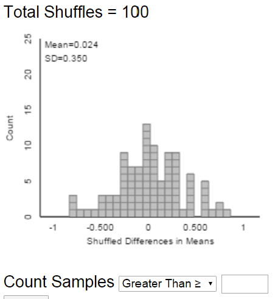

# Null Hypothesis Testing

-   Statisticians view conjectures about a population as competing
    *hypotheses*.
    These hypotheses
    usually constitute claims about the values of certain parameters.
-   A statistical **(null) hypothesis test** consists of using data to
    make a decision regarding two explanations (hypotheses).
-   The **null hypothesis**, denoted $H_0$, represents the "status
    quo/no difference/no effect/no association" hypothesis.
    -   If the null hypothesis is true then any observed
        difference/effect/association is just due to "random chance"
        resulting from natural sampling variability
-   The **alternative hypothesis**, denoted $H_a$ (or $H_1$), typically
    corresponds to what the researchers are hoping to gather evidence to
    support, and thus is a statement in line with the research
    conjecture
-   A statistical hypothesis test assesses if the data provide evidence
    to rule out the "random chance" explanation (which corresponds to
    the null hypothesis) in favor of the explanation provided by the
    research conjecture (alternative hypothesis).
-   The null hypothesis is often of the form
    $$H_0: \text{parameter} = \text{hypothesized value}$$ where the
    hypothesized value is a specific number determined by the research
    question (often 0 for "no difference").
-   The alternative hypotheses is often of one of the following forms
    $$\begin{aligned}
        \text{Case 1a:}\quad  H_a: \text{parameter} &> \text{hypothesized value}\\
        \text{Case 1b:}\quad H_a: \text{parameter} &< \text{hypothesized value}\\
        \text{Case 2:}\quad H_a: \text{parameter} &\neq \text{hypothesized value (``two-sided'')}
    \end{aligned}$$ Which of the three cases above is appropriate is
    determined by the research conjecture. When in doubt, use a
    two-sided ($\neq$) alternative.


::: {#exm-nht-permutation}
Did the New England Patriots deliberately deflate
footballs in an NFL playoff game against the Indianapolis Colts on
January 18, 2015? The following table[^1] summarizes the decrease in air
pressure (psi), from pre-game to halftime, for the footballs from each
team that were checked at halftime by officials.
:::

| Team     | Deflation (psi) |      |      |      |      |      |      |      |      |      |      | Size |  Mean |    SD |
|----------|----------------:|-----:|-----:|-----:|-----:|-----:|-----:|-----:|-----:|-----:|-----:|-----:|------:|------:|
| Patriots |            1.00 | 1.65 | 1.35 | 1.80 | 1.40 | 0.90 | 0.65 | 1.40 | 1.55 | 2.00 | 1.60 |   11 | 1.391 | 0.402 |
| Colts    |            0.30 | 0.25 | 0.50 | 0.45 |      |      |      |      |      |      |      |    4 | 0.375 | 0.119 |                                                 4   0.375   0.119

1.  Compute the observed difference in sample means.
\
\
\
\
\
2.  If there were no difference between the Patriots and the Colts footballs, what would you expect the difference in sample means to be?
    Is the fact that we observed another value necessarily evidence that the Patriots footballs tended to deflate more than the Colts?
\
\
\
\
\
3.  Suppose we want to assess if it is plausible that the Patriots
    didn't interfere with the footballs, and the observed difference in
    sample means is just due to chance variability.
    Specify how the "null distribution" of the statistic could be
    simulated with cards.
    Note: this is NOT bootstrapping; how is it different?
\
\
\
\
\
4.  Use cards to perform one repetition of the above simulation, record
    the results here, and compute the appropriate difference in means.
    
| Team     | Deflation (psi) |   |   |   |   |   |   |   |   |   |   | Size | Mean | SD |
|----------|----------------:|:-:|:-:|:-:|:-:|:-:|:-:|:-:|:-:|:-:|:-:|-----:|-----:|---:|
| Patriots |                 |   |   |   |   |   |   |   |   |   |   |   11 |      |    |
| Colts    |                 |   |   |   |   | X | X | X | X | X | X |    4 |      |    |

5.  The following plot displays results from an [applet](https://www.rossmanchance.com/applets/2021/anovashuffle/AnovaShuffle.htm?hideExtras=2) used to run 10000
    repetitions of the simulation (the plot on the left displays the results
    from just the first 100 repetitions). Estimate the probability of
    observing a difference in sample means as extreme as the observed difference just by chance 
    if there were no real difference between the Patriots and Colts footballs.

::: {#fig-permutation-applet layout-ncol=2}
{#fig-permutation-applet-1}

{#fig-permutation-applet-2}

Permutation simulation of null distribution in @exm-nht-permutation.
:::

6.  Is it plausible that the observed difference in means is just due to
    random chance?
    To support your answer, interpret the probability from the previous part in context.
\
\
\
\
\

-   To assess the plausibility of the "random chance" explanation for the
    observed result --- corresponding to the null hypothesis being true --- we
    need to know the pattern of sampling variability of the
    statistic that would be expected just due to random chance if the
    null hypothesis were true. This is called the **null distribution**
    of the statistic.
-   If the actual observed value of the statistic is not consistent with
    this pattern, then we have convincing evidence that the results did
    not occur by random chance alone, and we have evidence to reject the
    null hypothesis
-   The (simulated) null distribution provides a picture of what typical
    values of the statistic would be expected just by random chance
    alone if the null hypothesis were true.
-   The question is then: how surprising is the result we actually
    observed from the perspective of the null distribution? If the
    result would be very surprising, then "random chance" is not a
    plausible explanation for the observed result.
-   This gives us evidence to rule out a "random chance" explanation
    like in favor of a "research conjecture" explanation.
-   In other words, the more surprising the observed result would be
    just due to random chance, the stronger the evidence to **reject the
    null hypothesis** in favor of the alternative hypothesis.
-   We quantify "how surprising" with a p-value.
    -   The **p-value** is the probability of observing a value at least
        as extreme as the value actually observed, when the null
        hypothesis is true.
    -   The p-value can be estimated by the proportion (out of the total
        number of repetitions) of values in the simulated null
        distribution that are *at least as extreme* as the actual
        observed value of the statistic.
        -   Which tail(s) constitutes "at least as extreme\" is
            determined by the form of the *alternative hypothesis*
-   The smaller the p-value --- that is, the closer the p-value is to 0
    --- the less plausible it is that the observed result occurred just
    by random chance alone.
-   Thus, **the smaller the p-value the stronger the evidence to reject
    the null hypothesis in favor of the alternative hypothesis.**
-   If the observed results provide strong evidence that the data did
    not arise by random chance alone --- that is, when the p-value is
    small --- then there is evidence of a **statistical difference**.
-   How small is a small p-value? You should think of a sliding scale: the
    closer the p-value gets to 0 the stronger the evidence to reject the
    null hypothesis in favor of the alternative. Some guidelines are below, but these
    should *not* be followed too strictly (especially when performing
    many hypothesis tests simultaneously):
-   Do NOT rely strictly on arbitrary thresholds like p-value $<$ 0.05.

| p-value                  | Evidence to reject the null hypothesis? |
|--------------------------|-----------------------------------------|
| Above 0.10               | Little to no evidence                   |
| Between 0.01 and 0.10    | Weak evidence                           |
| Between 0.001 and 0.01   | Moderate evidence                       |
| Between 0.0001 and 0.001 | Strong evidence                         |
| Less than 0.0001         | Very strong evidence                    |


::: {#exm-one-sample-t}
Carrying a heavy backpack can cause chronic shoulder, neck, and back pain.
A [common recommendation](https://www.chla.org/blog/advice-experts/your-childs-backpack-too-heavy#:~:text=Did%20you%20know%20the%20American,than%208%20to%2012%20pounds.) is that a daily backpack
should not weigh more than 10 percent of the wearer's body weight. Do Cal Poly
students follow this recommendation? That is, do the backpacks of Cal
Poly students weigh, on average, less than 10% of their bodyweight?
In a random sample of 100 Cal Poly students the sample mean backpack weight as percent of bodyweight is 7.71 percent with sample standard deviation 0.366 percent.
:::


1.  Identify the main parameter of interest with both words and an
    appropriate symbol.
\
\
\
\
\
2.  Translate the research question into a hypothesis testing problem by
    specifying, with both words and appropriate symbols, the null
    hypothesis and the alternative hypothesis.
\
\
\
\
\
3.  Identify the null distribution of sample means.
    (You might need to make some assumptions.)
\
\
\
\
\
4.  Compute the p-value.
\
\
\
\
\
5.  Interpret the p-value in context.
\
\
\
\
\
6.  Does the p-value provide evidence that backpacks of CalPoly students weigh, on average, less than 10% of their bodyweight?
Explain.
\
\
\
\
\
7.  Does the p-value provide evidence that backpacks of CalPoly students weigh, on average, *much* less than 10% of their bodyweight?
Explain.
\
\
\
\
\
8.  How could we address the question in the previous part?
\
\
\
\
\
9.  Do Cal Poly students follow the 10% recommendation?
    Is the analysis
    above the only way to address this question?
    Can you suggest another?
\
\
\
\
\


**One-sample $t$ test**

-   Situation: question concerns a single numerical variable of interest
-   Parameter: $\mu$ is the population mean (i.e. the mean value of the
    variable over all units in the population)
-   Goal: assess the plausibility of a claim about $\mu$ regarding a
    hypothesized value $\mu_0$
-   The null hypothesis is $H_0: \mu= \mu_0$
-   The alternative hypothesis is one of $H_a: \mu >\mu_0$,
    $H_a: \mu<\mu_0$, or $H_a: \mu\neq \mu_0$
    -   When in doubt, use a two-sided alternative and a two-tailed
    p-value.
-   Statistics: $\bar{x}$ is the sample mean; $s$ is the sample standard
    deviation
-   Test statistic: the standardized value of $\bar{x}$, where
    -   the mean is computed assuming the null hypothesis,
        $H_0: \mu=\mu_0$, is true, and
    -   the unknown SD ($\sigma/\sqrt{n}$) is estimated with the
        standard error $s/\sqrt{n}$
    $$
    t = \frac{\text{observed}-\text{hypothesized}}{\text{SE}} = \frac{\bar{x}-\mu_0}{s/\sqrt{n}}
    $$
-   The p-value is the probability of observing a value at least as
    extreme as $t$, in the tail direction indicated by the alternative
    hypothesis, for the $t$-distribution with $n-1$ degrees of freedom.
    -   In almost all situations encountered in practice you can use the usual empirical rule for Normal distributions
-   Assumptions:
    -   Simple random sample from a large population, that is,
        independent observations
    -   No bias in data collection
    -   Population mean is the parameter you want to estimate

```{python}
#| echo: false
#| 
import pandas as pd

df = pd.read_csv("https://raw.githubusercontent.com/kevindavisross/data301/main/data/AmesHousing.txt", sep="\t")

df["SingleFamily"] = (df["Bldg Type"] == "1Fam")

df["SalePriceK"] = df["SalePrice"] / 1000

df = df[["Bldg Type", "SingleFamily", "SalePriceK", "Gr Liv Area"]]

df_sf = df[df["SingleFamily"] == True]
```


::: {#exm-two-sample-t}
Continuing with the Ames housing data set.
Now suppose we want to compare sale prices of single family homes with other homes (including condos, townhouses, etc).
In particular, do single family homes tend to have higher sale prices on average than other homes?

The table below summarizes the sample data.
:::

```{python}
#| echo: false

df.groupby("SingleFamily")["SalePriceK"].describe()
```


1.  Explain how you could use simulation to approximate the p-value.
\
\
\
\
\
1.  Use the sample data to conduct by hand an appropriate hypothesis test.
\
\
\
\
\
1.  Write a clearly worded sentence interpreting the p-value in context.
\
\
\
\
\
1.  Does the p-value provide evidence that single family homes tend to have higher sale prices on average than other homes?
Explain.
\
\
\
\
\
1.  Does the p-value provide evidence that single family homes tend to have *much* higher sale prices on average than other homes?
Explain.
\
\
\
\
\
1.  How could we address the question in the previous part?
\
\
\
\
\


**Two-sample $t$ test for a difference in population (or treatment) means.**

-   Situation: binary explanatory variable (population/treatment 1, 2)
    and numerical response variable
-   Parameter: $\mu_1-\mu_2$ is the difference in population means
    (treatment means)
-   Goal: assess the strength of the evidence against the "no
    difference" or "no treatment effect" hypothesis
-   The null hypothesis is $H_0: \mu_1-\mu_2=0$
-   The alternative hypothesis is one of $H_a: \mu_1-\mu_2>0$,
    $H_a: \mu_1-\mu_2<0$, or $H_a: \mu_1-\mu_2\neq0$
    -   When in doubt, use a two-sided alternative and a two-tailed
    p-value.
-   Statistic: $\bar{x}_1-\bar{x}_2$ is the difference in sample means
    for samples (groups) of size $n_1, n_2$
-   The SE of the difference in sample means is
    $$
    \textrm{SE}(\bar{x}_1-\bar{x}_2) = \sqrt{\frac{s_1^2}{n_1}+\frac{s_2^2}{n_2}} = \sqrt{\textrm{SE}^2(\bar{x}_1)+\textrm{SE}^2(\bar{x}_2)}
    $$
-   Test statistic:
    $$
    t = \frac{\text{observed}-\text{hypothesized}}{\text{SE}} = \frac{\bar{x}_1-\bar{x}_2-0}{\sqrt{\frac{s_1^2}{n_1}+\frac{s_2^2}{n_2}}}
    $$
-   The p-value is the probability of observing a value at least as
    extreme as $t$, in the tail direction indicated by the alternative
    hypothesis, for the $t$-distribution with (complicated) degrees of freedom.
    -   In almost all situations encountered in practice you can use the usual empirical rule for Normal distributions
-   Assumptions:
    -   Either
        -   The data are obtained through two unbiased and independent
            random samples from large populations
            -   Or from one unbiased random sample which is classified
                according to two variables, and the two groups can be
                considered independent of each other.
        -   The data are obtained from an experiment in which subjects
            were randomly assigned to two treatments.
    -   No bias in data collection
    -   Difference in population means is the parameter you want to
        estimate
-   The $t$ procedures for population means are valid as long as the
    sample size is large enough, regardless of the shape of the
    population distribution.
-   **However, if the population distributions are highly skewed, then
    the population *medians* might be more appropriate parameters to
    consider as measures of center.**
-   Which is more appropriate, the population means or the population
    medians, depends on the purpose for the inference.
-   Also remember that sample means and SDs, and hence $t$ procedures,
    are sensitive to outliers and extreme values.


::: {#exm-ci-nht-compare}
In @exm-one-sample-t and @exm-two-sample-t we both performed a null hypothesis test and computed a confidence interval.
Discuss the advantages and disadvantages of each approach.
\
\
\
\
\
:::

-   Confidence intervals and hypothesis tests are commonly used in
    conjunction, but they address different questions
    -   Hypothesis test: How strong is the evidence that there is a difference (or association or effect)?
    -   Confidence interval: How large is the difference (or association or effect)?
-   A confidence interval
    -   provides a range of plausible values
    -   but the cut-off between plausible and implausible is arbitrary
        (e.g. 95% confidence corresponds to $\alpha=0.05$)
        -   But be especially careful about interpreting confidence when
            conducting multiple confidence intervals.
-   A null hypothesis test
    -   Considers the plausibility of only a single hypothesized value
    -   But provides a precise measure --- the p-value --- of the
        plausibility of the particular hypothesized value in light of
        the observed data
        -   But be especially careful about interpreting p-values when
            conducting multiple hypothesis tests.


[^1]: Source:
    <http://a.espncdn.com/pdf/2015/0506/PatriotsWellsReport.pdf>
