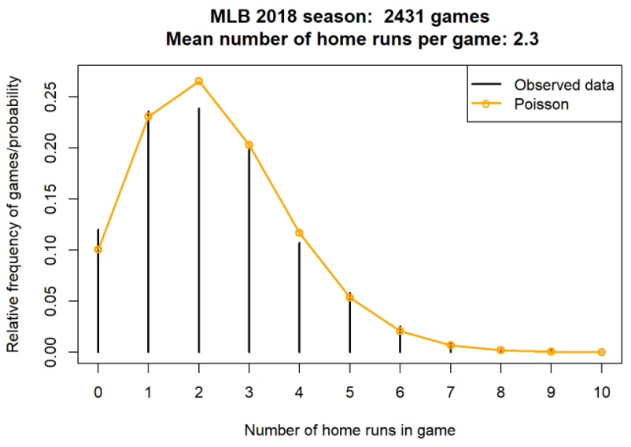

# Commmon Discrete Distributions




## Poisson Distributions

::: {#exm-poisson-hr}
Let $X$ be the number of home runs hit (in total by both teams) in a randomly selected Major League Baseball game.
Technically, there is no fixed upper bound on what $X$ can be, so mathematically it is convenient to consider $0, 1, 2, \ldots$ as the possible values of $X$.
Assume that the pmf of $X$ is
$$
p_X(x) =
e^{-2.3} \frac{2.3^x}{x!}, x = 0, 1, 2, \ldots
$$ This distribution is called the Poisson(2.3) distribution.
:::

1.  Compute $\text{P}(X = 3)$. Then interpret the value as a long run relative frequency, and a relative likelihood.\
    \
    \
    \
    \
2.  Construct a table, plot, and spinner corresponding to the distribution of $X$.\
    \
    \
    \
    \
3.  Compute and interpret $\text{P}(X \le 2)$.\
    \
    \
    \
    \
4.  Compute and interpret $\text{P}(X \le 13)$. ([The most home runs ever hit in a baseball game is 13](https://www.mlb.com/news/d-backs-and-phillies-set-mlb-home-run-record).)\
    \
    \
    \
    \

```{r}
#| label: poisson-hr-data
#| echo: false
#| fig-cap: "Relative frequencies of home runs per game in the 2018 MLB season, compared with the Poisson(2.3) distribution."



```

| $x$ |                         $p(x)$ |    Value |
|-----|-------------------------------:|---------:|
| 0   |     $e^{-2.3}\frac{2.3^0}{0!}$ | 0.100259 |
| 1   |     $e^{-2.3}\frac{2.3^1}{1!}$ | 0.230595 |
| 2   |     $e^{-2.3}\frac{2.3^2}{2!}$ | 0.265185 |
| 3   |     $e^{-2.3}\frac{2.3^3}{3!}$ | 0.203308 |
| 4   |     $e^{-2.3}\frac{2.3^4}{4!}$ | 0.116902 |
| 5   |     $e^{-2.3}\frac{2.3^5}{5!}$ | 0.053775 |
| 6   |     $e^{-2.3}\frac{2.3^6}{6!}$ | 0.020614 |
| 7   |     $e^{-2.3}\frac{2.3^7}{7!}$ | 0.006773 |
| 8   |     $e^{-2.3}\frac{2.3^8}{8!}$ | 0.001947 |
| 9   |     $e^{-2.3}\frac{2.3^9}{9!}$ | 0.000498 |
| 10  | $e^{-2.3}\frac{2.3^{10}}{10!}$ | 0.000114 |
| 11  | $e^{-2.3}\frac{2.3^{11}}{11!}$ | 0.000024 |
| 12  | $e^{-2.3}\frac{2.3^{12}}{12!}$ | 0.000005 |
| 13  | $e^{-2.3}\frac{2.3^{13}}{13!}$ | 0.000001 |
| 14  | $e^{-2.3}\frac{2.3^{14}}{14!}$ | 0.000000 |

: Table representing the Poisson(2.3) probability mass function.

```{r}
#| include: false
#| eval: false

dpois(3, 2.3)
```

```{r}
#| include: false
#| eval: false

x = 0:14

p_x = dpois(x, 2.3)

data.frame(x, p_x) |>
  kbl(digits = 6) |>
  kable_styling(fixed_thead = TRUE)
```

```{r}
#| include: false
#| eval: false

sum(dpois(0:2, 2.3))
```

```{r}
#| include: false
#| eval: false

ppois(2, 2.3)
```

```{r}
#| include: false
#| eval: false

sum(dpois(0:13, 2.3))
```

```{r}
#| include: false
#| eval: false

ppois(13, 2.3)
```

```{r}
#| include: false
#| eval: false

rpois(10, 2.3)
```

```{r}
#| label: fig-poisson-hr
#| include: false
#| eval: false
#| fig-cap: "Simulated distribution of $X$ with a Poisson(2.3) distribution."

N_rep = 10000

x = rpois(N_rep, 2.3)

# Summarize the simulate values
plot(table(x) / N_rep,
     type = "h",
     xlab = "x",
     ylab = "Approximate P(X = x)")
```

```{r}
#| label: spinner-poisson-hr
#| echo: false
#| fig-cap: "Spinner corresponding to the Poisson(2.3) distribution (values 6, 7, ... lumped into one 6+ category)."

x = c(0:5, "6+")
p = c(dpois(0:5, 2.3), 1-ppois(5, 2.3))

xp <- data.frame(x, p)

cdf = c(0, cumsum(xp$p))

plotp = (cdf[-1] + cdf[-length(cdf)]) / 2
  
spinner <- ggplot(xp, aes(x="", y=p, fill=x))+
  geom_bar(width = 1, stat = "identity", color="black", fill="white") + 
  coord_polar("y", start=0) +
  theme_void() + 
  # plot the possible values on the outside
  scale_y_continuous(breaks = plotp, labels=xp$x) +
  theme(axis.text.x=element_text(size=14, face="bold")) +
  # plot the probabilities as percents inside
  geom_text(aes(y = plotp,
                label = percent(p)), size=4,
            color=c(rep("black", 6), rep("white", 1))) +
  ggtitle(paste("Poisson(2.3) spinner", sep=""))

spinner

```

-   A discrete random variable $X$ has a **Poisson distribution** with parameter $\mu>0$ if its probability mass function $p_X$ satisfies $$
      p_X(x) = \frac{e^{-\mu}\mu^x}{x!}, \quad x=0,1,2,\ldots
      $$
-   The function $\mu^x / x!$ defines the shape of the pmf. The constant $e^{-\mu}$ ensures that the probabilities sum to 1.
-   Poisson distributions are often used to model random variables which count the number of "relative rare" events that occur.
-   If $X$ has a Poisson($\mu$) distribution, $\text{P}(X = 0) = e^{-\mu}$ and the probabilitiies of possible values follow the

$$
\text{Poisson(}\mu\text{) pattern:}\quad x \text{ is } \frac{\mu}{x} \text{ as likely as } x-1 \quad \text{ (for } x = 1, 2, 3, \ldots)
$$


## Binomial Distributions

::: {#exm-binomial-stock}
Consider an extremely simplified model for the daily closing price of a certain stock.
Every day the price either goes up or goes down, and the movements are independent from day-to-day.
Assume that the probability that the stock price goes up on any single day is 0.25.
Let $X$ be the number of days in which the price goes up in the next 5 days.
:::

1.  Compute and interpret $\text{P}(X=0)$.\
    \
    \
    \
    \
    \
2.  Compute the probability that the price goes up on the first day and then down on the following four days.\
    \
    \
    \
    \
    \
3.  Why is $\text{P}(X=1)$ different from the probability in the previous part? Compute and interpret $\text{P}(X=1)$.\
    \
    \
    \
    \
4.  Suggest a general formula for the probability mass function of $X$.\
    \
    \
    \
    \

-   A discrete random variable $X$ has a **Binomial distribution** with parameters $n$, a nonnegative integer, and $p\in[0, 1]$ if its probability mass function is \begin{align*}
    p_{X}(x) & = \binom{n}{x} p^x (1-p)^{n-x}, & x=0, 1, 2, \ldots, n
    \end{align*}
-   The *binomial coefficient* (read "$n$ choose $x$") $$
      \binom{n}{x} = \frac{n!}{x!(n-x)!}
      $$ counts the number of success/failure sequences of length $n$ in which there are exactly $x$ successes. (Remember: by definition $0! = 1$.)

::: {#exm-binomial-stock-again}
Continuing @exm-binomial-stock.
:::

1.  Construct a table, plot, and spinner representing the distribution of $X$.\
    \
    \
    \
    \
2.  Compute and interpret $\text{P}(X \le 2)$.\
    \
    \
    \
    \

| $x$ |                             $p(x)$ |    Value |
|-----|-----------------------------------:|---------:|
| 0   | $\binom{5}{0}0.25^0(1-0.25)^{5-0}$ | 0.237305 |
| 1   | $\binom{5}{1}0.25^1(1-0.25)^{5-1}$ | 0.395508 |
| 2   | $\binom{5}{2}0.25^2(1-0.25)^{5-2}$ | 0.263672 |
| 3   | $\binom{5}{3}0.25^3(1-0.25)^{5-3}$ | 0.087891 |
| 4   | $\binom{5}{4}0.25^4(1-0.25)^{5-4}$ | 0.014648 |
| 5   | $\binom{5}{5}0.25^5(1-0.25)^{5-5}$ | 0.000977 |

: Table representing the Binomial(5, 0.25) probability mass function.

```{r}
#| include: false
#| eval: false

dbinom(1, 5, 0.25)
```

```{r}
#| include: false
#| eval: false

x = 0:5

p_x = dbinom(x, 5, 0.25)

data.frame(x, p_x) |>
  kbl(digits = 6) |>
  kable_styling(fixed_thead = TRUE)
```

```{r}
#| include: false
#| eval: false

sum(dbinom(0:2, 5, 0.25))
```

```{r}
#| include: false
#| eval: false

pbinom(2, 5, 0.25)
```

```{r}
#| include: false
#| eval: false

rbinom(10, 5, 0.25)
```

```{r}
#| label: fig-binomial-stock-sim
#| fig-cap: "Simulated distribution of $X$ with a Binomial(5, 0.25) distribution."
#| include: false
#| eval: false

N_rep = 10000

x = rbinom(N_rep, 5, 0.25)

# Summarize the simulated values
plot(table(x) / N_rep,
     type = "h",
     xlab = "x",
     ylab = "Approximate P(X = x)")
```

```{r}
#| label: spinner-binomial-stock
#| echo: false
#| fig-cap: "Spinner corresponding to the Binomial(5, 0.25) distribution (4 and 5 lumped into 4+)."


x = c(0:3, "4+")
p = c(dbinom(0:3, 5, 0.25), 1-pbinom(3, 5, 0.25))

xp <- data.frame(x, p)

cdf = c(0, cumsum(xp$p))

plotp = (cdf[-1] + cdf[-length(cdf)]) / 2
  
ggplot(xp, aes(x="", y=p, fill=x))+
  geom_bar(width = 1, stat = "identity", color="black", fill="white") + 
  coord_polar("y", start=0) +
  theme_void() +
  # plot the possible values on the outside
  scale_y_continuous(breaks = plotp, labels=xp$x) +
  theme(axis.text.x=element_text(size=14, face="bold")) +
  # plot the probabilities as percents inside
  geom_text(aes(y = plotp,
                label = percent(p)), size=4,
            color=c(rep("black", 4), rep("white", 1))) +
  ggtitle(paste("Binomial(5, 0.25) spinner", sep=""))

```

```{r}
#| include: false
#| eval: false

sum(dbinom(0:2, 5, 0.25))

pbinom(2, 5, 0.25)
```


::: {#exm-binomial-stock2}
Continuing @exm-binomial-stock.
:::

1.  What does the random variable $5-X$ represent? What is its distribution?\
    \
    \
    \
    \
2.  Suppose that the price is currently \$100 and each it either moves up \$2 or down \$2. Let $S$ be the stock price after 5 days. How does $S$ relate to $X$? Does $S$ have a Binomial distribution?\
    \
    \
    \
    \
3.  Recall that $X$ is the number of days on which the price goes up in the next five days. Suppose that $Y$ is the number of days on which the price goes up in the ten days after that (days 6-15). What is the distribution of $X+Y$? (Continue to assume independence between days, with probability 0.25 of an up movement on any day.)\
    \
    \
    \
    \

-   Imagine a box containing tickets
    -   Each ticket is labeled either 1 ("success") or 0 ("failure")
    -   $p$ is the proportion of tickets in the box labeled 1 ("success"); the rest are labeled 0 ("failure").
    -   Randomly select $n$ tickets from the box *with replacement* and let $X$ be the number of tickets in the sample that are labeled 1.
    -   Then $X$ has a Binomial($n$, $p$) distribution.
    -   Since the tickets are labeled 1 and 0, the random variable $X$ which counts the number of successes is equal to the sum of the 1/0 values on the tickets.
-   The above situation involves a sequence of **Bernoulli(**$p$) trials.
    -   There are only two possible outcomes, "success" (1) and "failure" (0), on each trial.
    -   The unconditional/marginal probability of success is the same on every trial, and equal to $p$
    -   The trials are independent
        -   If sampling with replacement, or
        -   If sampling without replacement but the population size (number of tickets in the box) is much larger than the sample size $n$
-   If $X$ counts the number of successes in a *fixed number*, $n$, of Bernoulli($p$) trials then $X$ has a Binomial($n, p$) distribution.

::: {#exm-binomial-situation}
In each of the following situations determine whether or not $X$ has a Binomial distribution.
If so, specify $n$ and $p$.
If not, explain why not.
:::

1.  Roll a die 20 times; $X$ is the number of times the die lands on an even number.\
    \
    \
    \
    \
2.  Roll a die 20 times; $X$ is the number of times the die lands on 6.\
    \
    \
    \
    \
3.  Roll a die until it lands on 6; $X$ is the total number of rolls.\
    \
    \
    \
    \
4.  Roll a die 20 times; $X$ is the sum of the numbers rolled.\
    \
    \
    \
    \
5.  Shuffle a standard deck of 52 cards (13 hearts, 39 other cards) and deal 5 *without replacement*; $X$ is the number of hearts dealt. (Hint: be careful about why.)\
    \
    \
    \
    \
6.  Roll a fair six-sided die 10 times and a fair four-sided die 10 times; $X$ is the number of 3s rolled (out of 20).\
    \
    \
    \
    \
7.  Randomly select a sample of 35 Cal Poly students; $X$ is the number of students in the sample who are CA residents.\
    \
    \
    \
    \

::: {#exm-dd-same-distribution}
Donny Dont is thoroughly confused about the distinction between a random variable and its distribution.
Help him understand by by providing a simple concrete example of *two different random variables* $X$ and $Y$ that have the *same distribution*.
Can you think of $X$ and $Y$ that have the same distribution but for which $\text{P}(X = Y) = 0$?
(Hint: think coin flipping.)
:::

\
\
\
\
\
